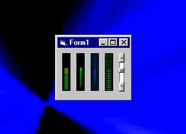



## SkinnableMeter

### Description

Change the appearance of a progress bar with bitmap files, I included a few sample skins. Use's the BitBlt API Function, On a usercontrol.
 
### More Info
 

             |
---                |---
**Submitted On**   |2001-08-14 12:49:26
**By**             |[Jerrame Hertz](https://github.com/Planet-Source-Code/PSCIndex/blob/master/ByAuthor/jerrame-hertz.md)
**Level**          |Beginner
**User Rating**    |4.5 (77 globes from 17 users)
**Compatibility**  |VB 5\.0, VB 6\.0
**Category**       |[Custom Controls/ Forms/  Menus](https://github.com/Planet-Source-Code/PSCIndex/blob/master/ByCategory/custom-controls-forms-menus__1-4.md)
**World**          |[Visual Basic](https://github.com/Planet-Source-Code/PSCIndex/blob/master/ByWorld/visual-basic.md)
**Archive File**   |[SkinnableM246438142001\.zip](https://github.com/Planet-Source-Code/jerrame-hertz-skinnablemeter__1-22810/archive/master.zip)

